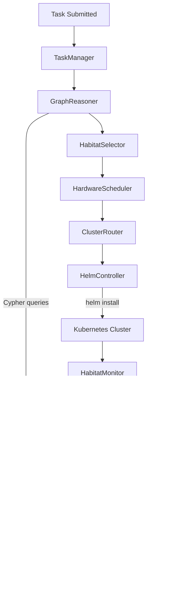

# Raphael System Architecture

Raphael is an autonomous, event-driven, multi-agent orchestrator. The architecture is primarily divided into a central nervous system (Swarm Director) and its distributed physical manifestations (Habitats).

**→ [Architecture & dataflow diagrams](architecture_diagrams.md)** — System overview, Director workflow, event bus dataflow, agent dispatch, knowledge graph, memory system, habitats lifecycle, experiments, observability, and full 13-layer view.

## Core Architecture Flow

## Layers

1.  **Director (`director/`)**: The main control loop that parses incoming tasks, queries the knowledge graph, and orchestrates the deployment of habitats.
2.  **Graph (`graph/`)**: The Neo4j long-term memory containing the schema, constraints, capabilities, relationships, and performance metrics of the swarm.
3.  **Habitats (`habitats/`)**: The templated environments (Helm charts) that house the agents.
4.  **Agents (`agents/`)**: The specialized LLM-driven components (planners, coders, researchers) executing logic within a habitat.
5.  **Infrastructure (`infrastructure/`)**: The physical or virtual cluster (like k3d or a remote GPU server) running the habitats.
6.  **Experiments (`experiments/`)**: Sandboxed workloads that the Director schedules during idle time to train agents and discover optimal blueprints.
7.  **Observability (`observability/`)**: OpenTelemetry tracing, Prometheus metrics scraping, and Grafana dashboards for monitoring swarm health.
