# Architecture & Dataflow Diagrams

This document collects **architecture** and **workflow/dataflow** diagrams for each major piece of the Raphael project. All diagrams use [Mermaid](https://mermaid.js.org/) and render in GitHub, VS Code, and most Markdown viewers.

---

## Index

| Diagram | Description |
|--------|-------------|
| [System overview](#1-system-overview) | High-level Swarm Director + Habitats + Graph |
| [Director workflow](#2-director-workflow) | Task lifecycle: observe → reason → select → deploy → monitor |
| [Event bus dataflow](#3-event-bus-dataflow) | Event types and which layers publish/subscribe |
| [Cognitive pipeline (L3→L7)](#4-cognitive-pipeline-l3l7) | Task understanding → Spine → Cognition → Swarm → Agents |
| [Agent dispatch workflow](#5-agent-dispatch-workflow) | PLAN_FINALIZED → dispatch → execute → SUBTASK_COMPLETED |
| [Knowledge graph dataflow](#6-knowledge-graph-dataflow) | Who reads/writes Neo4j and which nodes/edges |
| [Memory system dataflow](#7-memory-system-dataflow) | Working memory, episodic, semantic, operational KG |
| [Habitats lifecycle](#8-habitats-lifecycle) | Deploy → run → metrics → evolver → destroy |
| [Experiments workflow](#9-experiments-workflow) | Idle-time injection → task → evaluate → metrics |
| [Observability dataflow](#10-observability-dataflow) | HabitatMetrics → Neo4j; Prometheus scrape targets |
| [Full 13-layer architecture](#11-full-13-layer-architecture) | Complete system (reference to existing diagram) |
| [AI Router workflow](#12-ai-router-workflow) | Request → perception → node selection → LLM dispatch |
| [Task flow engine](#task-flow-engine-circulatory-system) | User task → Planner → Router → Worker → Evaluator → Memory |

---

## Task flow engine (circulatory system)

The task flow is the circulatory system: every user task flows through the same pipeline. **No agent talks to the user directly except the Planner** — this keeps the swarm organized.

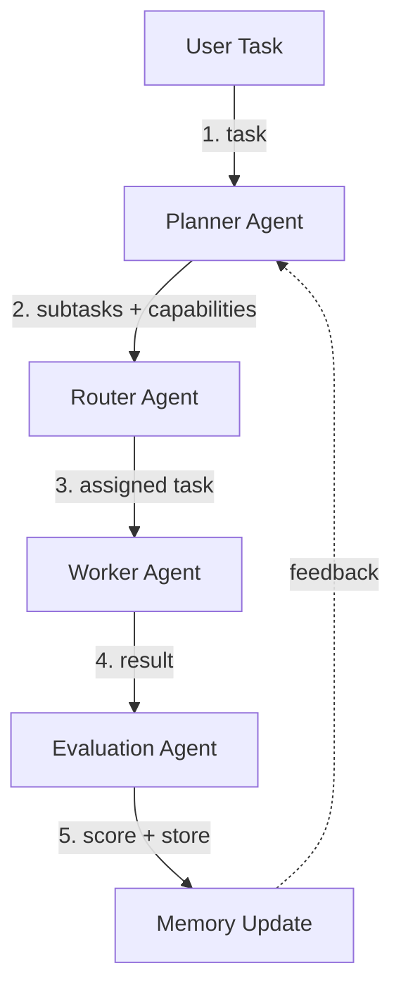

**Rule:** Only the Planner has a user-facing interface. All other agents receive and return structured payloads via the event bus / orchestrator.

---

## 1. System overview

High-level architecture: Director as central orchestrator, Graph as long-term memory, Habitats as execution environments.

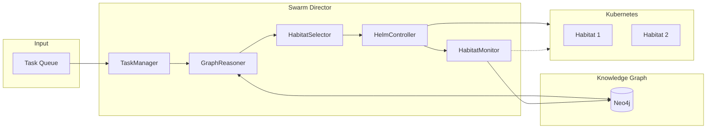

---

## 2. Director workflow

Dataflow through the Swarm Director main loop. Each task moves through these stages.

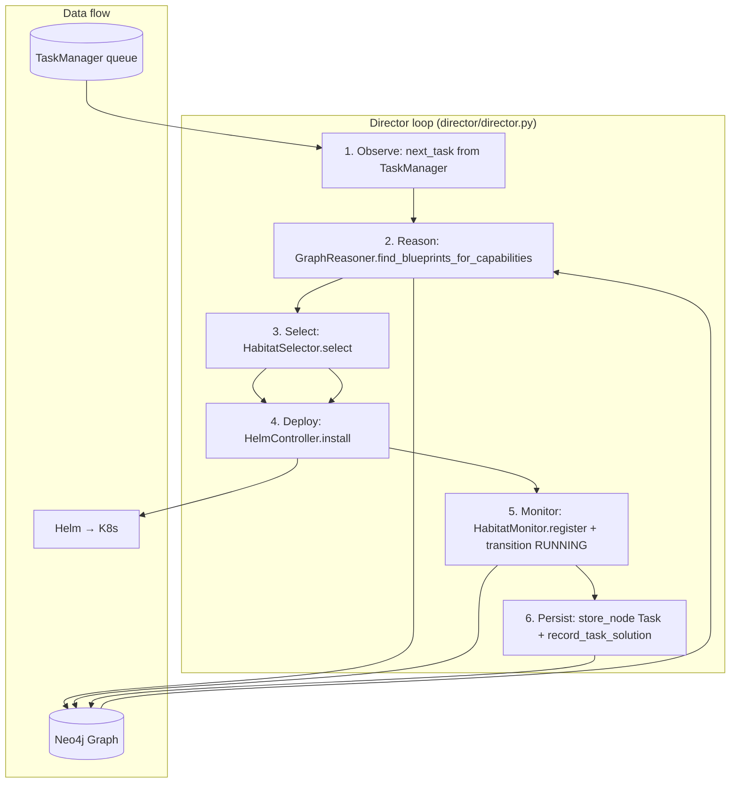

---

## 3. Event bus dataflow

Which layers publish and subscribe to which event types. Arrows: **publish → subscribe**.

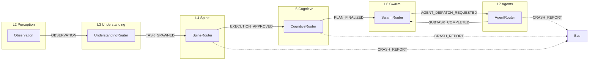

---

## 4. Cognitive pipeline (L3→L7)

End-to-end workflow from observation to agent execution. Data flows top-to-bottom; event bus carries payloads between layers.

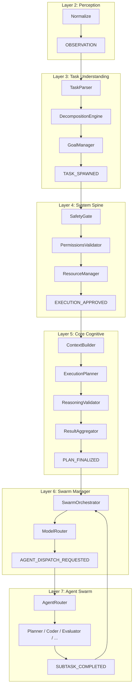

---

## 5. Agent dispatch workflow

How a finalized plan becomes agent executions and how completions feed back.

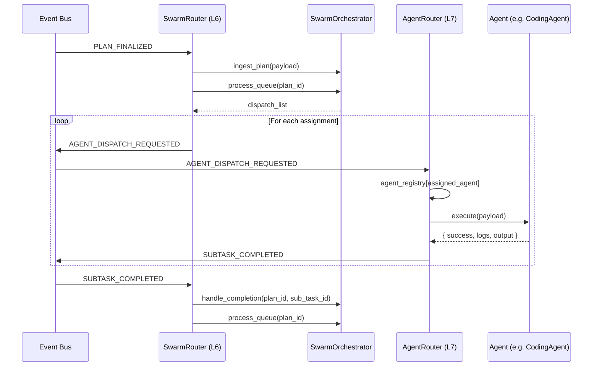

---

## 6. Knowledge graph dataflow

Who reads from and writes to the Neo4j graph. Schema is in `docs/graph_schema.md` and `graph/graph_api.py` (ALLOWED_LABELS, ALLOWED_RELATIONSHIPS).

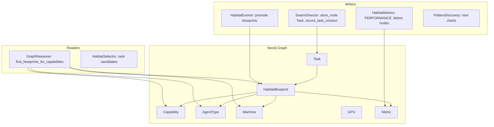

---

## 7. Memory system dataflow

How different memory stores are used by layers. Aligns with `docs/diagrams/polyglot_memory_system-*.mmd`.

**Memory verification and target:** The diagram in `docs/diagrams/polyglot_memory_system-2026-02-22-205539.mmd` has been aligned with current implementation (Director, Consolidation, AI Router → stores). The PNG (`polyglot_memory_system-2026-02-22-205537.png`) is the **target** architecture; see **`docs/diagrams/MEMORY_SYSTEM_VERIFICATION.md`** for current vs. future (Polyglot L0, Temporal Graph, layer–store wiring) and recommendations.

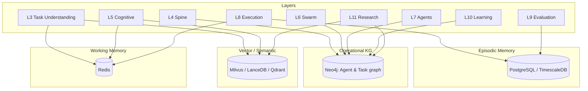

---

## 8. Habitats lifecycle

From Director decision to deploy through monitoring and teardown. Includes evolution feedback.

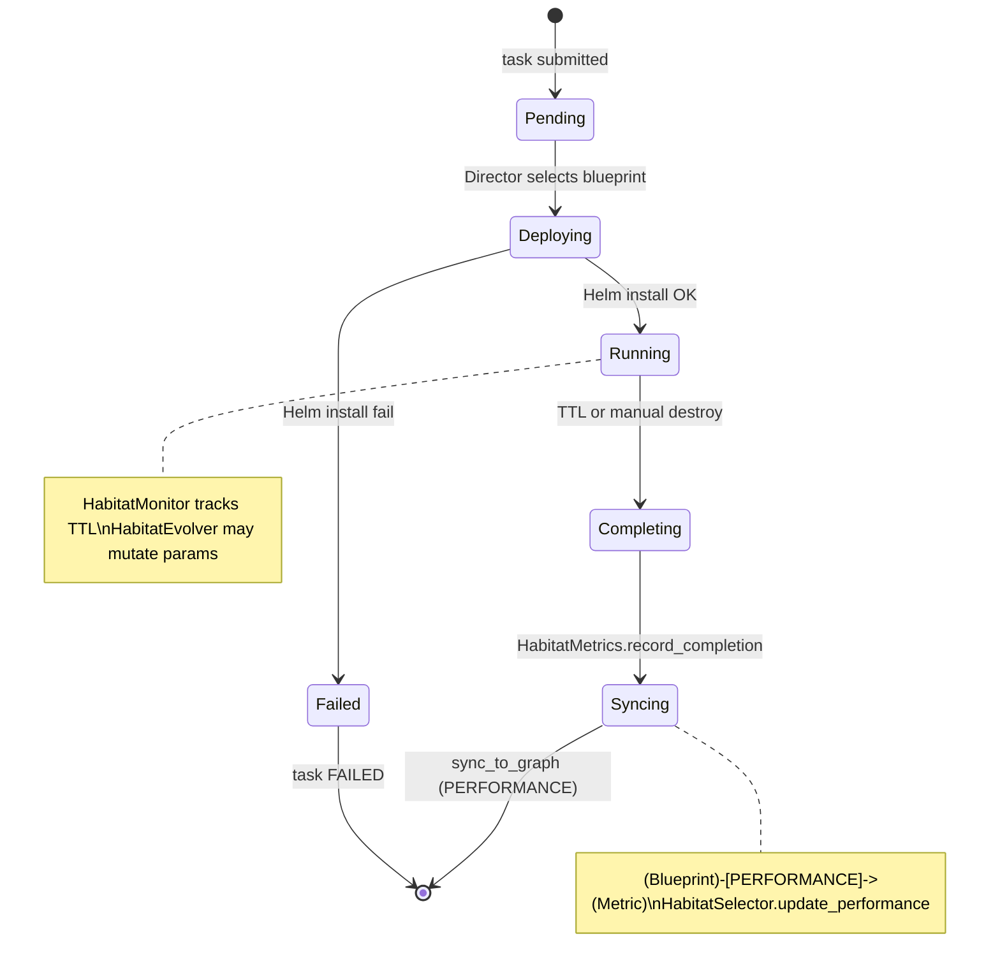

---

## 9. Experiments workflow

How experiments are injected when the queue is idle and how results feed metrics.

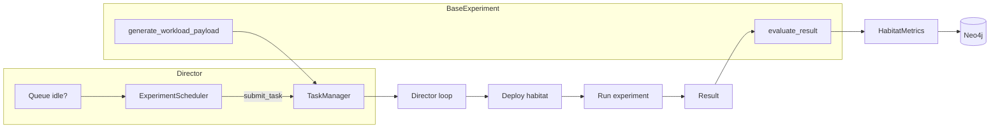

---

## 10. Observability dataflow

Where metrics are produced and where they are consumed. Prometheus/Grafana config lives in `observability/`.

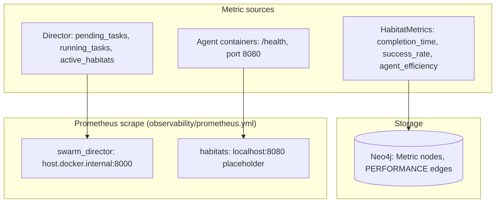

---

## 11. Full 13-layer architecture

The complete system view with all 13 layers and supporting systems (Memory, World Model, Registry, Event Bus) is in:

- **`docs/diagrams/complete_system_architecture.mmd`** — Mermaid flowchart with `layout: elk`; open in Mermaid Live Editor or a tool that supports `.mmd` for full layout.

Below is a simplified version that fits in-doc rendering.

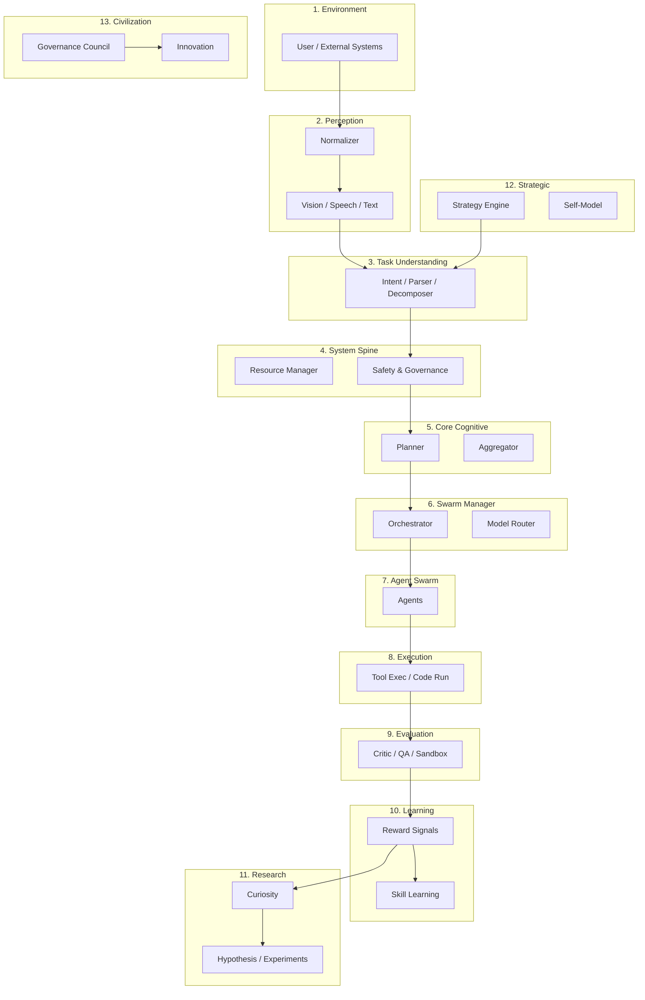

---

## Layer-specific diagrams (existing)

Detailed per-layer Mermaid source files in `docs/diagrams/`:

| Layer | File |
|-------|------|
| 1 Environment | `1-environment_layer-*.mmd` |
| 2 Perception | `2-perception_layer-*.mmd` |
| 3 Task Understanding | `3-task_understanding_layer-*.mmd` |
| 4 System Spine | `4-system_spine_layer-*.mmd` |
| 5 Core Cognitive | `5-core_cognitive_layer-*.mmd` |
| 6 Swarm Manager | `6-swarm_manager_layer-*.mmd` |
| 7 Agent Swarm | `7-agent_swarm-*.mmd` |
| 8 Execution & Integration | `8-execution-integration_layer-*.mmd` |
| 9 Evaluation | `9-evaluation_layer-*.mmd` |
| 10 Learning | `10-learning_layer-*.mmd` |
| 11 Autonomous Research | `11-autonomous_research_layer-*.mmd` |
| 12 Strategic Intelligence | `12-strategic_intelligence-*.mmd` |
| 13 Civilization Loop | `13-civilization_layer-*.mmd` |
| Memory (polyglot) | `polyglot_memory_system-*.mmd` |

These can be opened in [Mermaid Live](https://mermaid.live/) or rendered by tools that support Mermaid (e.g. `mmdc` from `@mermaid-js/mermaid-cli`).

**Diagram verification:** For a comparison of these diagrams with this document and the codebase (inconsistencies, missing elements, placeholder files), see **[docs/ARCHITECTURE_DIAGRAM_VERIFICATION.md](ARCHITECTURE_DIAGRAM_VERIFICATION.md)**.

---

## 12. AI Router workflow

The **AI Router** (`ai_router/`) is a FastAPI service that manages node registration, perception, working memory, and routing of requests to LLM-capable nodes. It can run alongside or in place of the core event-bus pipeline for node-centric workflows.

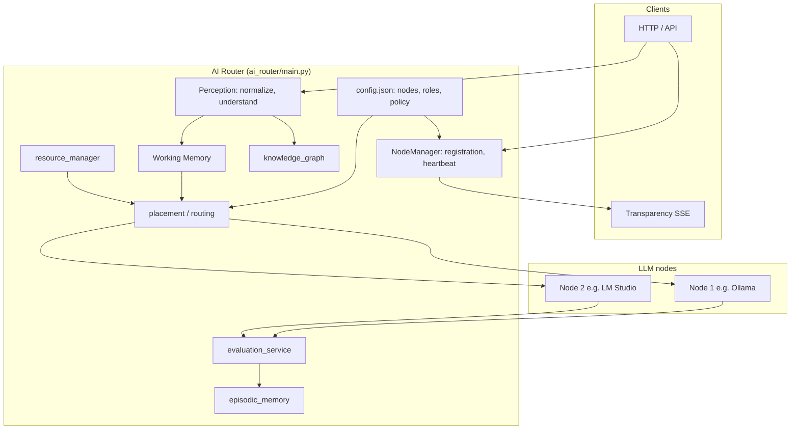

