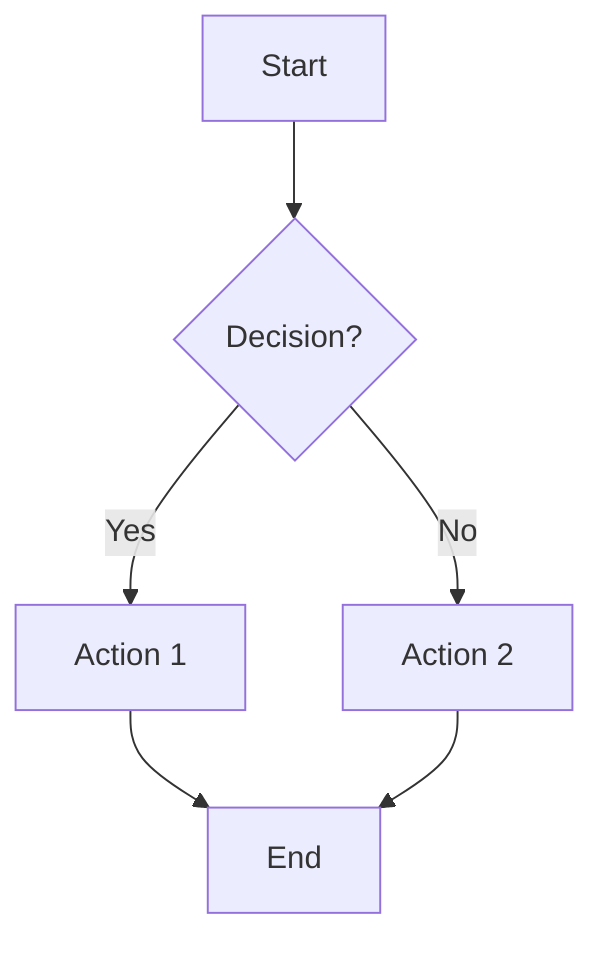
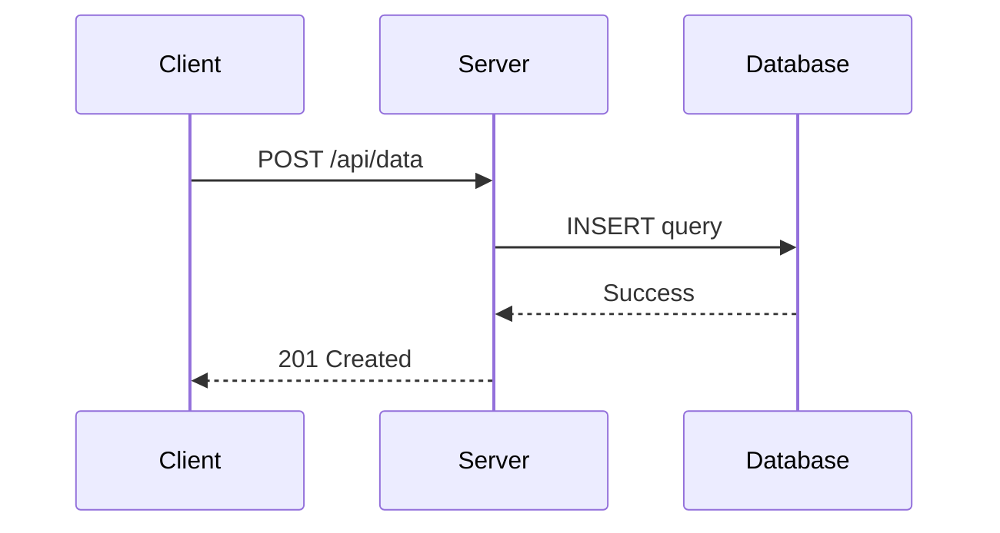
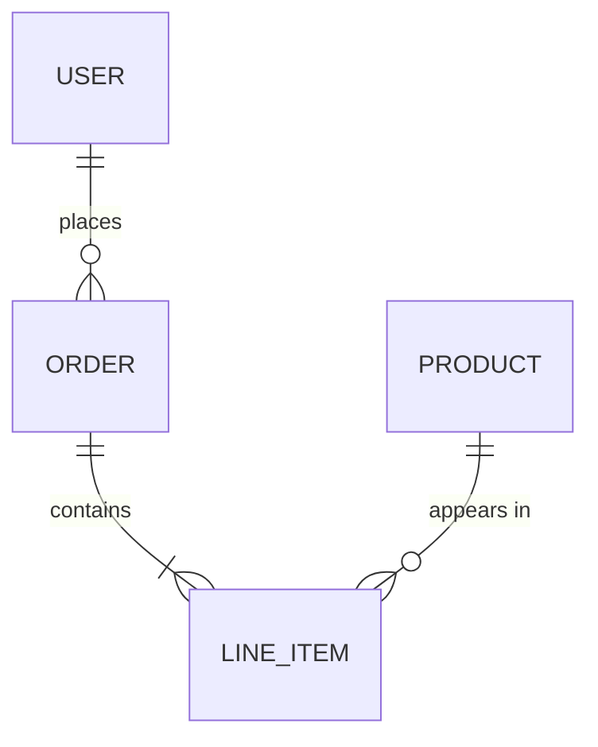
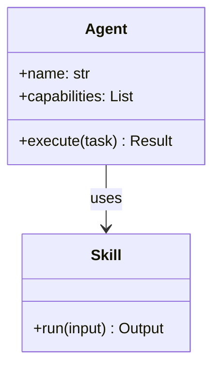

# Generate Graph

Create visual representations of data and architecture — charts, plots, diagrams, and flowcharts.

## When to Use

- User requests a **chart**, **graph**, **plot**, or **diagram**
- Visualizing data trends, distributions, comparisons, or relationships
- Creating architecture diagrams, flowcharts, sequence diagrams, or entity-relationship diagrams
- Embedding visuals in documentation or reports

## Environment Context

The user has 4 active workspaces (Corpora) that may contain relevant data or codebase elements for graphs:
- `/Users/yamai/ai/Raphael`
- `/Users/yamai/ai/agent_ecosystem`
- `/Users/yamai/ai/network_observatory`
- `/Users/yamai/ai/portfolio`

## Workflow

### 1. Determine Visualization Type

| Data / Need           | Chart Type           | Tool       |
| --------------------- | -------------------- | ---------- |
| Trend over time       | Line chart           | Matplotlib |
| Category comparison   | Bar chart            | Matplotlib |
| Distribution          | Histogram / Box plot | Matplotlib |
| Proportions           | Pie / Donut chart    | Matplotlib |
| Correlation           | Scatter plot         | Matplotlib |
| System architecture   | Block diagram        | Mermaid    |
| Process flow          | Flowchart            | Mermaid    |
| API interactions      | Sequence diagram     | Mermaid    |
| Data models           | ER diagram           | Mermaid    |
| Quick terminal visual | ASCII chart          | Python     |

### 2. Generate with Matplotlib

Create a Python script and execute via `run_command`:

```python
import matplotlib
matplotlib.use('Agg')  # Non-interactive backend — ALWAYS include this
import matplotlib.pyplot as plt
import json

# Load data
# data = json.load(open('data.json'))
# OR use inline data

fig, ax = plt.subplots(figsize=(10, 6))

# --- Line Chart ---
ax.plot(x_data, y_data, marker='o', linewidth=2, color='#4F46E5')

# --- Bar Chart ---
ax.bar(categories, values, color=['#4F46E5', '#7C3AED', '#EC4899'])

# --- Scatter Plot ---
ax.scatter(x, y, c=colors, s=sizes, alpha=0.6)

# Styling
ax.set_title('Title', fontsize=16, fontweight='bold')
ax.set_xlabel('X Label')
ax.set_ylabel('Y Label')
ax.grid(True, alpha=0.3)
fig.tight_layout()

# Save
output_path = '/absolute/path/to/output.png'
fig.savefig(output_path, dpi=150, bbox_inches='tight')
print(f'Chart saved to {output_path}')
```

**Important:**
- Always use `matplotlib.use('Agg')` before importing `pyplot`
- Always use absolute paths for output
- Use `dpi=150` for crisp images
- Save to the project directory or artifacts directory as appropriate

### 3. Generate with Mermaid

Embed Mermaid diagrams directly in Markdown files:

#### Flowchart


#### Sequence Diagram


#### Entity-Relationship


#### Architecture / Class Diagram


### 4. Generate ASCII Charts (No Dependencies)

For quick terminal-friendly visuals:

```python
def ascii_bar(label, value, max_val, width=40):
    bar_len = int(value / max_val * width)
    bar = '█' * bar_len + '░' * (width - bar_len)
    return f'{label:>15} |{bar}| {value}'

data = {'CPU': 72, 'Memory': 45, 'Disk': 88, 'Network': 23}
max_v = max(data.values())
for label, val in data.items():
    print(ascii_bar(label, val, max_v))
```

### 5. Using the `generate_image` Tool

For conceptual diagrams, mockups, or artistic visualizations, use the `generate_image` tool with a detailed prompt describing the desired chart or diagram.

## Best Practices

- **Choose the right chart**: Don't use pie charts for >6 categories; prefer bar charts
- **Label everything**: Titles, axis labels, legends, units
- **Color palette**: Use accessible, harmonious colors — avoid pure red/green together
- **Aspect ratio**: Use `figsize=(10, 6)` for landscape, `(8, 8)` for square
- **Font sizes**: Title 16pt, labels 12pt, ticks 10pt minimum

## Error Handling

- **Missing matplotlib**: `pip install matplotlib` or fall back to Mermaid/ASCII
- **Display issues**: Always use `Agg` backend — never rely on GUI display
- **Large datasets**: Sample data before plotting to keep charts readable
- **Mermaid syntax errors**: Quote labels with special characters, avoid HTML in labels
